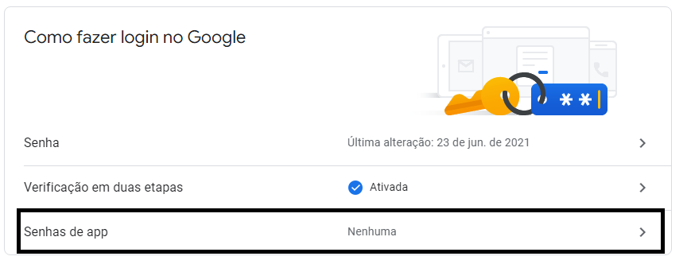
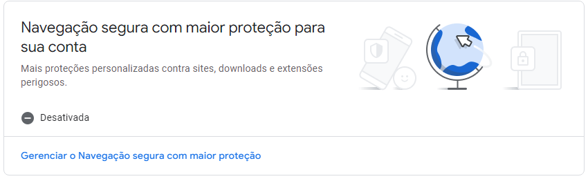

# send_email
This is a code for sending email to many recipients a faster and simple.

*** Remember to change the email to code ***

 *** 1 - If you use two factor authentication *** 
 Is necessary a app password, you can create in your account google:
 
 
 *** 2 - Is necessary the deactivate a "Safe browsing with greater protection for your account" in google configs ***
 
